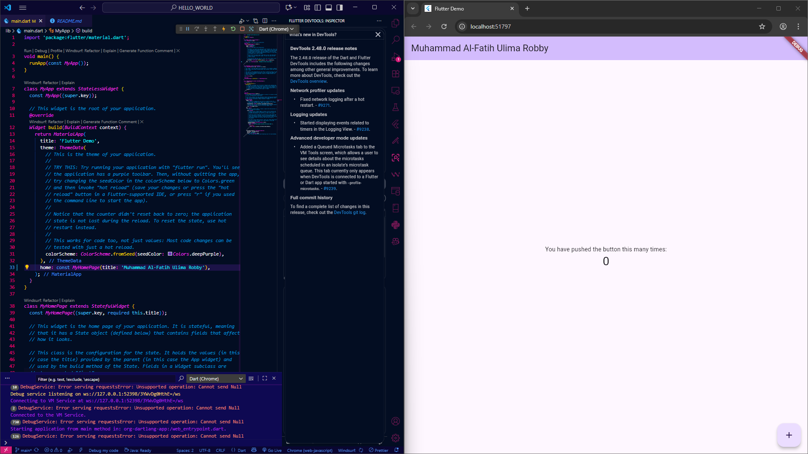
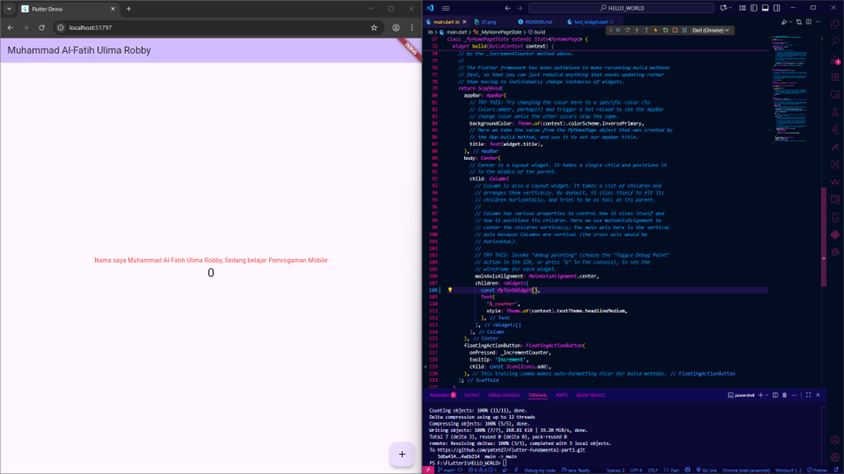
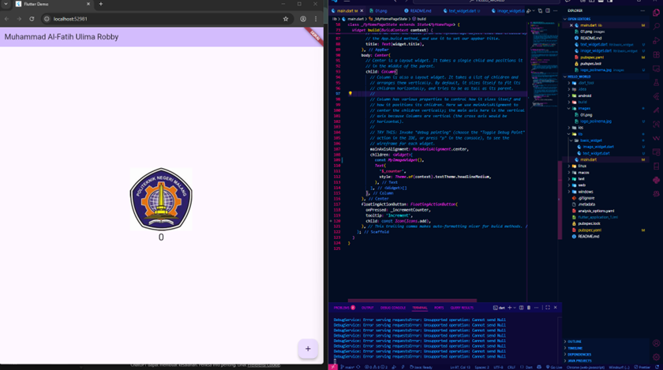
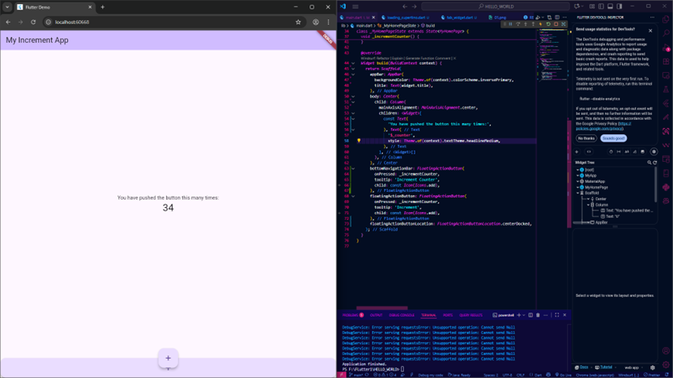
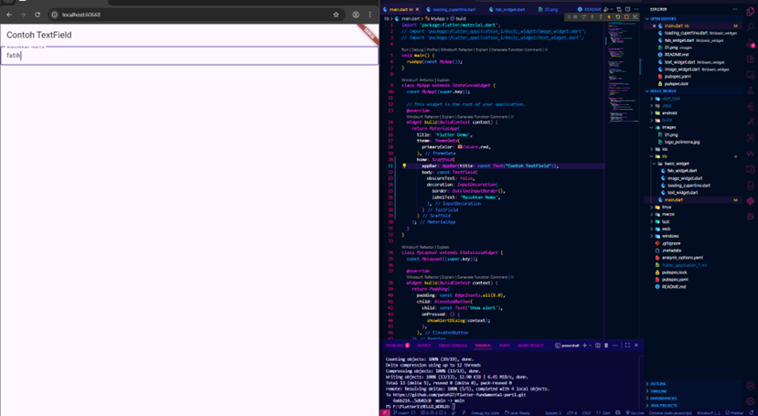
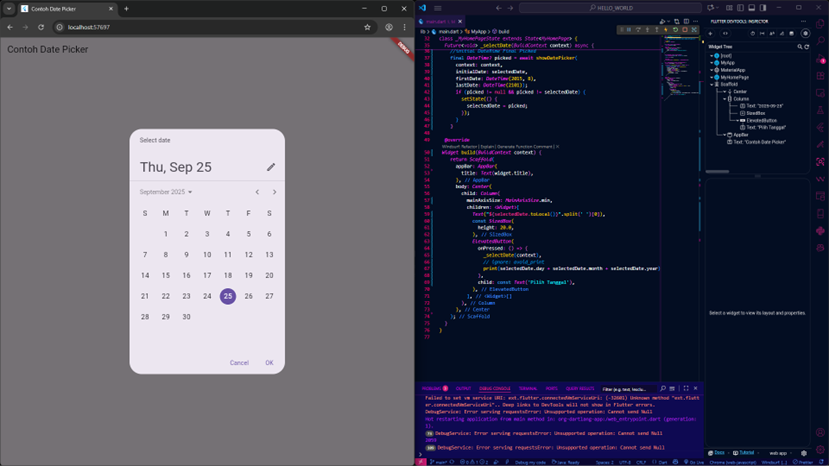

Nama: Muhammad Al-Fatih Ulima Robby
NIM:2341720119

# hello_world

A new Flutter project.

# praktikum 4

Basic Widget Flutter project
Ini adalah awalan saya belajar membuat widget yang ada di flutter(bahasa dart) yang mana ini hanya mengetikkan nama saya saja.

Sekarang saya mengganti nama saya menjadi logo polinema seperti pada gambar dibawah ini, menggunakan image_widget pada folder basic_widget yang saya import ke main dart.

# Praktikum 5

Sekarang saya membuat Cupertino Button dan Loading Bar yang mana itu digunakan untuk membuat tombol yang jika di click otomotis bertambah +1 dan seterusnya

Untuk selanjutnya saya melakukan percobaan membuat TextField yang mana dapat menginputkan Nama, kelas, dan lain-lain seperti gambar di bawah ini.

# Date and Time Pickers

Digunakan untuk menentukan tanggal, tanggal tersebut dapat kita set sesuai hari ini dengan contoh screenshot yang ada dibawah ini.

<!-- ## Getting Started

This project is a starting point for a Flutter application.

A few resources to get you started if this is your first Flutter project:

- [Lab: Write your first Flutter app](https://docs.flutter.dev/get-started/codelab)
- [Cookbook: Useful Flutter samples](https://docs.flutter.dev/cookbook)

For help getting started with Flutter development, view the
[online documentation](https://docs.flutter.dev/), which offers tutorials,
samples, guidance on mobile development, and a full API reference. -->
